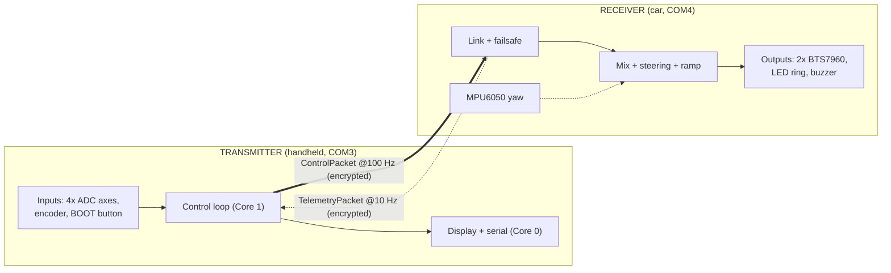

# Vector-RC Architecture

This describes the **present** architecture as implemented in the V6 sketches. The firmware lives
in single-file Arduino sketches, but it is organized around clear conceptual layers. This doc maps
each concern — **components, networking, encryption, communication, configuration, control** — to
where it actually lives in the code, so you can reason about one layer without reading all 880 lines.

Two independent ESP32-S3 nodes, no infrastructure between them:

Everything below is one of these layers. The **Layer → code map** table at the end is the quick index.

---

## 1. Components

### Transmitter node

| Component | Hardware | Firmware responsibility | Where |
| --- | --- | --- | --- |
| Analog input | ADS1115 16-bit ADC (I2C) | Read 4 joystick axes | `readAxis()`, `ads.readADC_SingleEnded()` |
| Input smoothing | — | 3-sample moving average per axis | `class AxisFilter` |
| Axis mapping | — | Deadband + split min/center/max scale + invert → ±1000 | `splitMapAxis()` |
| UI input | Rotary encoder + BOOT button | Debounce, short/long/multi-click detection | `updateEncoder()` |
| Display | ST7735 128x128 (SPI) | Status screen + calibration wizard UI | `drawScreen()`, `displayTask()` |
| Status light | 1x WS2812 (onboard) | Link/kill/telemetry state color | `updateStatusLed()` |
| Persistence | Internal flash (NVS) | Store/load axis calibration | `saveCalibrationToNvs()` / `loadCalibrationFromNvs()` |

### Receiver node

| Component | Hardware | Firmware responsibility | Where |
| --- | --- | --- | --- |
| Motor drive | 2x BTS7960 H-bridge | LEDC PWM (20 kHz, 8-bit), direction, differential drive | `drive()`, `setupMotors()` |
| Motion shaping | — | 3-tier ramp, speed-aware steering, rate limit, stall guard | `rampPwm()`, `updateMotorOutputs()`, `applySteeringRateLimit()` |
| Yaw sensing | MPU6050 IMU (I2C) | Gyro-Z rate + offset calibration, turn tests | `setupMpu()`, `updateMpu()`, `executeTurnDegrees()` |
| Lights | 16x WS2812 ring | Headlights, turn arcs, kill/link/calibration states | `updateLights()` |
| Audible | Active buzzer (GPIO37) | Startup + event tones | `buzz()`, `startupPattern()` |
| Console | USB serial | Runtime test/diagnostic commands | `handleSerialCommands()` |

Both nodes share the **same two packet struct definitions** and the **same CRC routine** — copied
verbatim into each sketch so they stay in sync (see Communication).

---

## 2. Networking layer

**Transport:** ESP-NOW — connectionless, addressed Wi-Fi frames, no AP/router, no TCP/IP stack.

- **Mode:** standard ESP-NOW **unicast** between two fixed MACs. *Not* ESP-NOW Long-Range (LR).
- **Wi-Fi setup (both nodes, identical):** `WIFI_STA`, `WiFi.disconnect()`, sleep disabled
  (`WiFi.setSleep(false)` + `esp_wifi_set_ps(WIFI_PS_NONE)`), fixed channel via
  `esp_wifi_set_channel(6, ...)`. Sleep-off + fixed channel is what keeps latency low and constant.
- **Peering:** each node calls `esp_now_add_peer()` once for the *other* node's MAC with
  `channel = 6`, `ifidx = WIFI_IF_STA`, `encrypt = true`. Set up in `setupEspNow()` +
  `addPeer()` (and `setupControllerPeer()` on the receiver).
- **Addressing:** the peer MAC is a configuration value, not discovered — it lives in `secrets.h`
  (`RECEIVER_MAC` on the transmitter, `TRANSMITTER_MAC` on the receiver).
- **Callbacks:** TX-complete (`onDataSent` / `onTelemetrySent`) and RX (`onControlRecv` /
  `onTelemetryRecv`) run in the Wi-Fi task context, *not* your loop — this is why shared state is
  behind critical sections (see Concurrency).

There is **no** RSSI/signal-strength monitoring. Link quality is inferred only from packet age and
the TX-complete ACK status.

---

## 3. Encryption layer

ESP-NOW provides the crypto; the firmware just supplies keys.

- **Cipher:** ESP-NOW encrypts unicast frames to encrypted peers with **AES-128-CCM** (provided by
  the ESP-IDF, not implemented here).
- **Keys:** a 16-byte **PMK** (primary master key, set once via `esp_now_set_pmk()`) plus a 16-byte
  **LMK** (local master key, per-peer, passed in `esp_now_peer_info_t.lmk`). Both nodes must carry
  **identical** PMK + LMK.
- **Key location:** keys now live in a **gitignored `secrets.h`** per sketch folder (previously
  inline in source). `secrets.example.h` is the committed template. This keeps keys out of the
  public repo — see Configuration.
- **Trust model — be honest about it:** this is a **single static symmetric key pair** shared by
  both boards. It defeats a casual sniffer. It is **not** a defense against anyone who has your
  `secrets.h`, and there is no key rotation or per-session handshake.

Encryption (does the frame get decrypted?) is distinct from **authentication of intent**: even a
correctly-decrypted frame is still checked for source MAC, version, length, and CRC before it moves
a motor (see Communication + Safety).

---

## 4. Communication layer

Two fixed-layout, versioned, CRC-protected structs. Both are `__attribute__((packed))` so the byte
layout is identical on both nodes regardless of compiler padding.

### ControlPacket (transmitter → receiver, 17 bytes)

| Field | Type | Meaning |
| --- | --- | --- |
| `version` | uint8 | `RC_PACKET_VERSION` (1); rejected if mismatched |
| `sequence` | uint16 | Monotonic counter, one per send |
| `throttle` | int16 | −1000 reverse … 0 … +1000 forward |
| `steering` | int16 | −1000 left … 0 … +1000 right |
| `speedLimit` | uint16 | 0..255 output ceiling |
| `aux1` / `aux2` | int16 | Mapped aux axes (aux2 selects `mode`) |
| `mode` | uint8 | 1..3 from aux2 position |
| `buttons` | uint8 | Bit mask: `BTN_KILL` / `BTN_LIGHTS` / `BTN_CALIBRATION` |
| `crc` | uint16 | CRC-16/CCITT over the struct with `crc` zeroed |

### TelemetryPacket (receiver → transmitter, 14 bytes)

| Field | Type | Meaning |
| --- | --- | --- |
| `version` | uint8 | Packet version |
| `sequenceAck` | uint16 | Echoes the last `ControlPacket.sequence` seen |
| `batteryMv` | uint16 | Battery mV — **currently always 0 (unimplemented)** |
| `leftMotor` / `rightMotor` | int16 | Effective PWM command applied |
| `linkState` | uint8 | Receiver's own link-OK flag |
| `packetAgeMs` | uint16 | Age of the last control packet the receiver acted on |
| `crc` | uint16 | CRC-16/CCITT |

### Integrity & cadence

- **CRC:** `crc16Ccitt()` (init `0xFFFF`, poly `0x1021`), computed with the `crc` field set to 0.
  Identical routine on both sides. Any mismatch → packet dropped.
- **Validation order on receive:** source MAC → length == `sizeof(struct)` → `version` → CRC. Only
  then is the packet copied into shared state under a mutex.
- **Send cadence:** transmitter sends every `SEND_INTERVAL_MS` (10 ms ≈ 100 Hz), gated on the
  previous TX-complete callback (`sendReady`) with a 50 ms watchdog so a lost callback can't stall
  the link. Receiver sends telemetry every 100 ms (≈ 10 Hz).
- **Failsafe:** receiver treats the link as dead if the newest valid control packet is older than
  `FAILSAFE_MS` (120 ms) → motors stopped. Transmitter treats telemetry as stale after
  `TELEMETRY_STALE_MS` (500 ms) → display shows "NO RX TEL".
- **Sequence numbers** are for observability (missed-packet tracking, ack echo), not retransmission
  — there is no ARQ; a dropped control packet is simply superseded by the next one 10 ms later.

---

## 5. Configuration layer

Three distinct configuration mechanisms, by lifetime:

1. **Compile-time (`#define` / `const`)** — pins, timing, and tuning. Changing these requires a
   reflash. Examples: `SEND_INTERVAL_MS`, `FAILSAFE_MS`, `ESPNOW_CHANNEL`, all GPIO pins, the
   steering gain curve (`STEERING_GAIN_LOW_SPEED` / `_HIGH_SPEED`), the 3-tier ramp rates
   (`MOTOR_ACCEL/DECEL/REVERSE_BRAKE_PWM_PER_SEC`), `MOTOR_DEADBAND`, `ENABLE_YAW_ASSIST`.
2. **Secrets (`secrets.h`, gitignored)** — ESP-NOW `ESPNOW_PMK`, `ESPNOW_LMK`, and the peer MAC.
   Copied from `secrets.example.h`. Separated specifically so the repo can be public.
3. **Runtime persistent (NVS / `Preferences`)** — transmitter axis calibration. The calibration
   wizard captures center/up/down/left/right, computes per-axis min/center/max/invert, and writes a
   `StoredCalibration` blob (magic + version + CRC) to NVS namespace `txcal`. On boot,
   `loadCalibrationFromNvs()` validates and applies it, overriding the in-code `axisCal[]` defaults.
   This survives reflash and is validated (magic/version/CRC) before use.

---

## 6. Control & data pipeline

The per-axis and per-motor math, end to end:

```mermaid
flowchart LR
  A["ADS1115 raw\n(0..~26000)"] --> B["AxisFilter\n3-sample avg"]
  B --> C["splitMapAxis\ndeadband + scale + invert\n→ ±1000"]
  C --> D["ControlPacket\nthrottle/steering"]
  D == radio ==> E["unpack + failsafe"]
  E --> F["scale to floats\nthrottle,steering ∈ [-1,1]"]
  F --> G["speed-aware\nsteering gain"]
  G --> H["steering rate limit\n(slew)"]
  H --> I["straight-line\nstall guard"]
  I --> J["diff mix\nL=thr+str, R=thr-str\nnormalize"]
  J --> K["× speedLimit\n→ target PWM"]
  K --> L["rampPwm\n3-tier accel/decel/brake"]
  L --> M["drive() → BTS7960"]
```

- **Transmitter side** (`buildPacket()`): read → filter → map. Aux channels are read at 1/5 rate.
- **Receiver side** (`loop()`): if `kill` (failsafe / kill bit / active turn test) → stop. Else run
  the mix chain above. Steering authority is high at low throttle and reduced at high throttle
  (quadratic blend), slew-rate-limited, with a straight-line assist that suppresses tiny steering
  bias so a near-center stick drives straight instead of crawling on one motor.

---

## 7. Concurrency & timing model

**Transmitter — two cores + radio callbacks:**

| Context | Runs | Touches |
| --- | --- | --- |
| Core 1 (`loop()`) | Encoder poll, build/send packet, status LED, `vTaskDelay(1)` yield | writes `lastBuiltPacket`, `sendReady` |
| Core 0 (`displayTask`) | ST7735 draw + serial print @ ~10 Hz | reads `lastBuiltPacket`, telemetry |
| Wi-Fi task (`onDataSent`) | Sets `sendReady` / `lastSendOk` | volatile flags |
| Wi-Fi task (`onTelemetryRecv`) | Validates + stores telemetry | `latestTelemetry` under `telemetryMux` |

The display was moved off the control loop specifically because ST7735 SPI writes take ~15 ms and
would otherwise blow the 10 ms send budget. Shared packet handoff uses `displayMux`; telemetry uses
`telemetryMux`.

**Receiver — single loop + radio callback:** `onControlRecv` validates and stores `latestPacket`
under `packetMux`; `loop()` snapshots it under the same mutex, then does failsafe + mixing + ramp +
lights + telemetry. MPU is polled in-loop at ≥5 ms spacing.

---

## 8. Safety architecture

Layered, fail-closed:

1. **MAC lock** — receiver ignores any frame whose source isn't `TRANSMITTER_MAC`.
2. **Format gate** — length + version + CRC must all pass before a packet is stored.
3. **Failsafe** — no valid packet within 120 ms → motors stopped, steering filter reset.
4. **Explicit kill** — `BTN_KILL` (encoder/BOOT long press) forces stop regardless of sticks;
   default state at boot is `killLatched = true` (armed only after an explicit action).
5. **Turn-test lockout** — an active MPU turn test forces `kill` so the normal mix can't fight it.
6. **Ramp limits** — even a valid command can't step-change PWM; kill/failsafe bypass the ramp to
   stop *immediately*.

---

## 9. Layer → code map (quick index)

| Layer | Transmitter | Receiver |
| --- | --- | --- |
| Components | `AxisFilter`, `updateEncoder`, `drawScreen` | `drive`, `updateLights`, `updateMpu` |
| Networking | `setupEspNow`, `addPeer` | `setupEspNow`, `setupControllerPeer` |
| Encryption | `esp_now_set_pmk`, peer `lmk`, `secrets.h` | same |
| Communication | `ControlPacket`, `crc16Ccitt`, `onTelemetryRecv` | `TelemetryPacket`, `onControlRecv`, `sendTelemetry` |
| Configuration | `#define`s, `secrets.h`, NVS `StoredCalibration` | `#define`s, `secrets.h` |
| Control | `buildPacket`, `splitMapAxis` | mix chain in `loop`, `rampPwm`, `applySteeringRateLimit` |
| Concurrency | `loop` (Core 1) + `displayTask` (Core 0) | single `loop` + recv callback |

---

*Describes V6 as committed. Update this doc in the same PR as any change to a packet struct, a
timing constant, the radio/encryption setup, or the control pipeline.*
