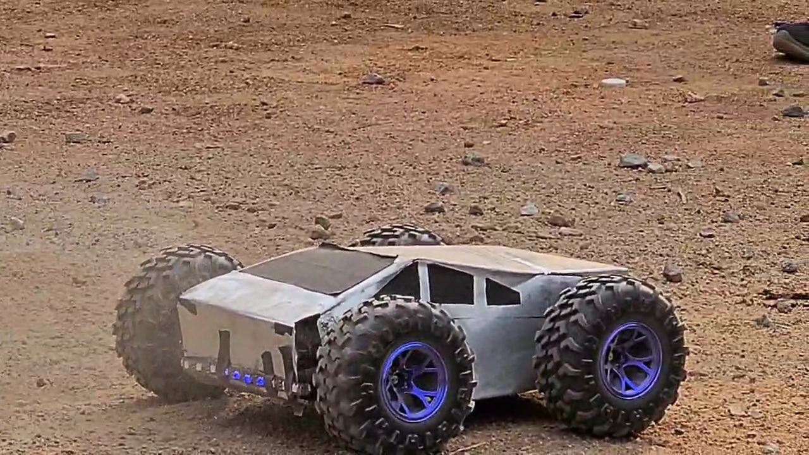
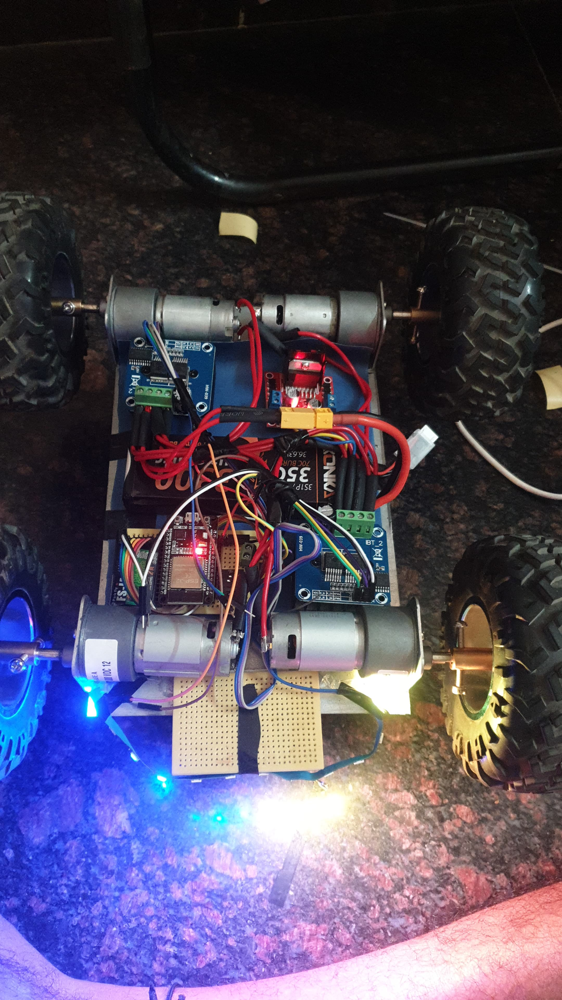

<div align="center">

# RC Race Car

**A radio-control car where both ends of the radio link are custom hardware.**



[](https://www.espressif.com/en/products/socs/esp32-s3)
[](docs/PROTOCOL.md)
[](docs/PROTOCOL.md#failsafe)
[](docs/)

[**Watch the test ride →**](media/test-ride.mp4) &nbsp;·&nbsp; [**Demo →**](media/demo.mp4)

</div>

---

No off-the-shelf receiver. A handheld ESP32-S3 transmitter talks to an ESP32-S3
on the car over encrypted ESP-NOW — 100 Hz, CRC-checked packets, bidirectional
telemetry, and a 120 ms failsafe.

One chassis, two generations. **V1** was built around a commercial 6-channel RC
receiver. **V2** kept the frame and replaced the motors, the battery and the
entire radio link.

|  | **V1 — Cyber Truck** | **V2 — Race Car** ✦ current |
|---|---|---|
| **Radio** | Commercial 6-ch receiver | Custom encrypted ESP-NOW peer link |
| **Controller** | ESP32 dev board | ESP32-S3 ×2 (transmitter + receiver) |
| **Motors** | Johnson 1000 RPM ×4 | 555 geared, 500 RPM |
| **Telemetry** | — | Bidirectional, ACK + sequence counters |
| **Failsafe** | Receiver signal loss | 120 ms timeout, CRC-validated |
| **IMU** | Optional, unused | MPU6050 with yaw-rate assist |
| **Code** | [`v1-cyber-truck/`](v1-cyber-truck/) | repository root |

---

## Why the motors got slower

V1 ran four Johnson 1000 RPM motors. On paper that is the faster car. In
practice it was the wrong number to optimise.

What reaches the ground is **torque at the wheel**, not motor RPM. Traction is
limited by the tyre — past the point where it breaks loose, extra RPM becomes
wheelspin instead of acceleration. And a heavier pack raises the torque needed
to move off from rest, which is exactly where a high-RPM, low-torque motor
stalls and draws current.

V2 runs **555-frame geared motors at 500 RPM** — half the free speed,
substantially more torque per wheel, chosen by working the torque budget per
tyre rather than chasing top speed.

That decision propagates into the firmware. `STALL_GUARD_MIN_PWM = 55` exists
because these motors will not reliably start under load below roughly 20 % duty,
so any commanded motion below that floor gets raised to it.

Full reasoning in **[docs/HARDWARE.md](docs/HARDWARE.md)**.

---

## Documentation

| | |
|---|---|
| **[HARDWARE.md](docs/HARDWARE.md)** | Both generations' BOMs, complete pinouts, the motor decision, known caveats |
| **[PROTOCOL.md](docs/PROTOCOL.md)** | Packet structs, CRC-16/CCITT, encryption, failsafe timing, dual-core split |
| **[TUNING.md](docs/TUNING.md)** | Motion profile, V7 steering model, yaw assist, retuning procedure |
| **[CALIBRATION.md](docs/CALIBRATION.md)** | Guided and host-driven capture workflows, current axis values |

---

## Quick start

Each sketch folder needs a `secrets.h` with the peer MAC and shared ESP-NOW
keys. It is gitignored — copy the example and fill it in:

```bash
cp transmitter_code/secrets.h.example              transmitter_code/secrets.h
cp receiver_code_advanced_mpu/secrets.h.example    receiver_code_advanced_mpu/secrets.h
```

Find a board's MAC with `WiFi.macAddress()` after `WiFi.mode(WIFI_STA)`. Both
ends need **identical** PMK and LMK and the same `ESPNOW_CHANNEL`, or the link
will not come up.

Then:

1. Flash `receiver_code_advanced_mpu` to the receiver.
2. Flash `transmitter_code` to the transmitter.
3. Open both serial monitors at `115200`.
4. Confirm the receiver reports link activity.
5. **Test with the wheels off the ground first.**

**Libraries** — `Adafruit ADS1X15` · `Adafruit GFX` · `Adafruit ST7735` ·
`Adafruit NeoPixel` · `Adafruit MPU6050` · `Adafruit Unified Sensor`

---

## Inside the chassis



Four brushed motors driven by a pair of BTS7960 H-bridges, an ESP32-S3 on
perfboard, and a 3S LiPo behind an XT60 connector.

Motor PWM runs at **20 kHz, 8-bit** — above audible range, so the drivetrain
does not whine under load. The mirrored motor mounting is corrected in software
via `LEFT_MOTOR_INVERT` rather than by swapping wires.

Control axes are read through a **16-bit ADS1115** rather than the ESP32's
internal ADC, whose noise floor is bad enough to be felt in a steering channel.

The receiver reports both requested (`spdReq`) and effective (`spdEff`) speed,
so ramping, speed limit and calibration scaling are all visible while driving.

<br clear="right">

---

## Transmitter controls

| Input | Action |
|---|---|
| Encoder rotate | Speed limit, 0–255 |
| Long press | Toggle kill |
| Single short press | Toggle lights |
| Triple short press | Toggle calibration mode |

`GPIO0` (BOOT) doubles as a runtime button — don't hold it during reset or
power-up. Calibration mode scales the full knob range into half output.

---

## Layout

```
transmitter_code/            V2 handheld transmitter  ← current
receiver_code/               V2 car receiver
receiver_code_advanced_mpu/  V2 receiver + MPU6050 yaw assist
v1-cyber-truck/              Generation 1 firmware
legacy_flysky_ibus/          FlySky iBUS receiver, reference only
tests/                       Per-subsystem test sketches
tools/                       Host-side calibration capture
calibration/                 Axis observations + a reference capture run
docs/                        Hardware, protocol, tuning, calibration
media/                       Photos and video
```

---

## Status

All main and test sketches compile cleanly. Flash usage is roughly 55 % for
`transmitter_code` and `receiver_code_advanced_mpu`, 53 % for `receiver_code`.
Known risks are tracked in
[docs/HARDWARE.md](docs/HARDWARE.md#known-hardware-caveats).

## Credits

**V1 — Cyber Truck** was built with **Vighnesh** (control algorithms, motor
driver interface) and **Karthekeya** (chassis design, LED system).
**V2** electronics and firmware by **Kamal Bura**.
